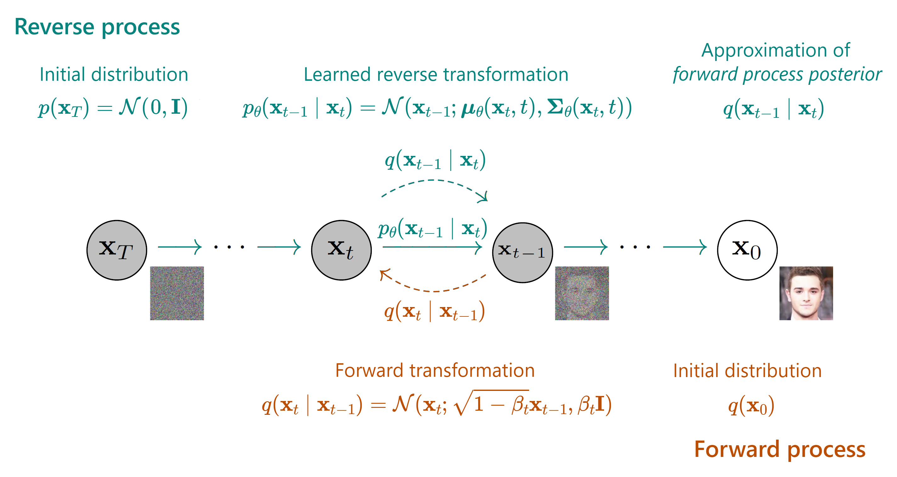
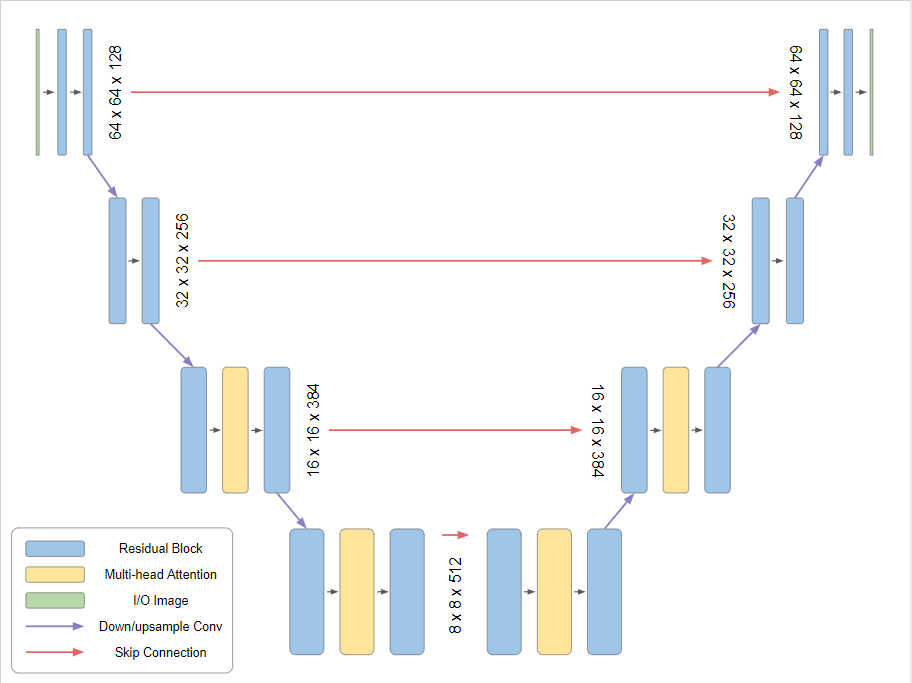

# Modelos de Difusión I
## Diplomado Universidad de Tarapacá

Eugenio Herrera-Berg
Centro Nacional de Inteligencia Artificial

---

# Un poco sobre mí

Alguno de mis proyectos Cenia:
- Latam-GPT: GPT 100% Latinoamericano
- Rial-AI: startup de Virtual Try-On
- Araucaria 🖌️

En una vida pasada:
- Trabajé en NotCo (2019-2020)
- Hice que la StyleGAN3 fuese guiada por texto (2020) 

<video controls autoplay loop muted width="90%">
  <source src="assets/videos/nicanor.mp4" type="video/mp4">
</video>

"A painting of Nicanor Parra", 2020

---

# Overview

1. Repaso modelos generativos
2. Modelos de difusión
  2.1 Denoising Diffusion Probabilistic Models
  2.2 Forward y Backward Process
  2.3 Loss
  2.4 Unet
3. Avances Formulación

---

# ¿Qué es un modelo generativo?

Es un modelo que busca aprender a representar una distribución.

---

# ¿Qué es un modelo generativo?

Es un modelo que busca aprender a representar una distribución.

Es decir, dado:

- Dataset $X = \{x_{1}, x_{2}, ..., x_{n}\}$, cuya distribución instrínseca desconocida es $p\_data(x)$
- Una distribución paramétrica $p\_{\theta}(x)$

Buscamos encontrar los parámetros $\theta^{*}$ tales que:

$\theta^{*} = min \ D(p\_data \ || \  p\_{\theta})$

Donde $D$ representa alguna métrica de distancia o divergencia entre distribuciones.

---

# Ejemplos de modelos generativos

- GPTs
- **Generative Adversarial Networks**
- Variational Autoencoders

---

# Generative Adversarial Networks

---

# Fortalezas GANs

- Generación de datos sintéticos de alta calidad.
- Rápida generación de imágenes.

---

# Debilidades GANs

Dificultad en aprender grandes distribuciones.

---
# ¿Por qué no basta con sólo GANs?

---

# ¿Qué son los Modelos de Difusión?

_"Crear ruido desde los datos es fácil;
crear datos desde ruido es modelamiento generativo."_

Song et.al. 2020

---

# ¿Qué son los Modelos de Difusión?

Denoising Diffusion Probabilistic Models [DDPM], 2020

---

# Denoising Diffusion Probabilistic Models (DDPMs)

DDPMs generan imágenes de forma progresiva a partir de ruido

Denoising Diffusion Probabilistic Models [DDPM], 2020

---

# Denoising Diffusion Probabilistic Models (DDPMs)

Para lograr que un modelo aprenda a generar imágenes a partir de ruido, necesitamos pares de entrenamiento en la forma de (ruido, imágenes).

Llamaremos al proceso que crea estos pares de entrenamiento **Forward Process**, encargado de convertir imágenes reales, en imágenes progresivamente más ruidosas.

---

# Denoising Diffusion Probabilistic Models (DDPMs)

Nuestro modelo generativo aprendererá a revertir este proceso (**Reverse Diffusion Process**). Es decir, progresivamente revertir el ruido de una imagen.

Una vez entrenado correctamente, el modelo contará con la capacidad recibir una imagen de ruido, y convertirla en una "real". En otras palabras, ¡generará imágenes desde puro ruido!

---

# Denoising Diffusion Probabilistic Models (DDPMs)

De manera más formal, los DDPMs iteran sobre $t$ pasos desde $0,1,...,T$

- $x_0$ es la imagen original
- $q(x_t|x_{t-1})$ es el forward process
- $p_{\theta}(x_{t-1}|x_t)$ es el reverse diffusion process (aprendido por nuestro modelo con parámetros $\theta$)

---

# Forward Process

El proceso de difusión puede ser descrito como:

$$q(x_t|x_{t-1}) = \mathcal{N}(x_t; \sqrt{1-\beta_t}x_{t-1}, \beta_t\mathbf{I})$$

donde:
- $x_t$ es la imagen con ruido en el paso $t$
- $\beta_t$ es el planificador de ruido (_noise scheduler_)
- $\mathcal{N}$ denota una distribución normal

---

# Forward Process

<video controls width="90%">
  <source src="assets/videos/DiffusionProcess.mp4" type="video/mp4">
</video>

---

# Forward Process

El proceso directo completo puede escribirse como:

$$q(x_{1:T}|x_0) = \prod_{t=1}^T q(x_t|x_{t-1})$$

y con el truco de reparametrización:

$$x_t = \sqrt{\alpha_t}x_0 + \sqrt{1-\alpha_t}\epsilon$$

donde

  - $\epsilon \sim \mathcal{N}(0, \mathbf{I})$
  - $\alpha_t = 1 - \beta_t$
  - $\bar{\alpha}_t = \prod_{i=1}^t \alpha_i$

---

# Truco de reparametrización

y con el truco de reparametrización:

$$x_t = \sqrt{\alpha_t}x_0 + \sqrt{1-\alpha_t}\epsilon$$

---

# Reverse process

El proceso inverso puede ser descrito como:
$$p_\theta(x_{t-1}|x_t) = \mathcal{N}(x_{t-1}; \mu_\theta(x_t,t), \Sigma_\theta(x_t,t))$$

donde:
- $x_t$ es la imagen con ruido en el paso $t$
- $\mu_\theta$ es la media de ruido predicha por la red neuronal 
- $\Sigma_\theta$ corresponde a la varianza de $\beta_t$ (no se aprende)
- $\theta$ son los parámetros del modelo

---

# Reverse process

Entrenaremos un modelo $p_\theta$ para que aprenda a revertir el proceso. 

Comenzando por $p(x_T) = \mathcal{N}(0, I)$, recreará la imagen siguiendo:

$$p_\theta(x_{0:T}) := p(x_T) \prod_{t=1}^T p_\theta(x_{t-1} | x_t)$$

---

# Resumen

---

# Loss

Originalmente, la pérdida en DDPMs corresponde al límite inferior variacional entre

$$L_{VLB} = \mathbb{E}_{q(x_{0:T})} \left[ -\log p(x_T) + \sum_{t=1}^T \left\| \frac{q(x_{t-1}|x_t,x_0)}{p_\theta(x_{t-1}|x_t)} \right\| \right]$$

En la práctica, esta se simplifica al Error Mínimo Cuadrado entre

$$L_{simple} = \mathbb{E}_{t,x_0,\epsilon} \left[ \|\epsilon - \epsilon_\theta(x_t,t)\|^2 \right]$$

Donde

- $\epsilon$ es el ruido agregado en el forward pass
- $\epsilon_\theta(x_t,t)$ es el ruido predecido por el modelo en el paso $t$

---

# U-Net y DDPMs

La U-Net es una CNN que:

- Procesa imágenes a múltiples escalas

- Procesa paralelamente detalles locales y globales

- Utiliza conexiones residuales (*skip connections*)

- Recibe como input:

  - Imagen ruidosa $x_t$
  - Paso de tiempo $t$ (embedding)

---

# U-Net y DDPMs

La U-Net actúa como el modelo $\epsilon_\theta$ que predice el ruido en cada paso:

$$L_{simple} = \mathbb{E}_{t,x_0,\epsilon} \left[ \|\epsilon - \epsilon_\theta(x_t,t)\|^2 \right]$$

donde para $\epsilon_\theta(x_t,t)$ la U-Net:
- Recibe la imagen ruidosa $x_t$ y el paso $t$
- Predice el ruido $\epsilon$ que se agregó
- Permite calcular la media $\mu_\theta$ para el proceso inverso

---

# Avances Teóricos en Modelos de Difusión

Los modelos de difusión han evolucionado significativamente desde DDPMs:

- **DDIM** (2020): Muestreo determinístico y acelerado
- **Score-based Models** (2020): Gradientes de score matching
- **Probability Flow ODE** (2021): Formulación continua
- **SDE** (2021): Marco teórico unificado
- **EDM** (2023): Mejoras prácticas y eficiencia

---
# Denoising Diffusion Implicit Models (DDIM) [2020]

DDIM propone un proceso de muestreo determinístico que:
- **Reduce el número de pasos necesarios (de 1000 a ~50)**
- Mantiene la calidad de las imágenes
- Permite interpolación significativa en el espacio latente
- No requiere reentrenamiento del modelo

$$\text{DDIM: } \mathbb{E}[x_{t-1}|x_t,x_0] = \sqrt{\alpha_{t-1}}\hat{x}_0 + \sqrt{1-\alpha_{t-1}}\bar{\epsilon}_\theta(x_t,t)$$

---
# Score-based Generative Modeling [2020]

Reformula la generación como un problema de estimación de gradientes:
- **Entrena el modelo para estimar $\nabla_x \log p(x)$**
- Unifica diferentes tipos de ruido
- Permite muestreo continuo
- **Base teórica para posteriores avances (SDE, Flow)**

$$\text{Score function: } s_\theta(x,t) = \nabla_x \log p_t(x)$$

---
# Probability Flow ODE [2021]

Reformulación del **proceso de difusión como una ODE**:
- Permite genación determinística
- Tiempo continuo vs discreto
- Base matemática más sólida
- Conexión con normalizing flows

$$\frac{dx}{dt} = f(x,t) + g(t)^2 \nabla_x \log p_t(x)$$

---
# SDE Formulation [2021]

Marco teórico unificado que:
- **Generaliza modelos previos (Score, Flow, DDPM)**
- Permite diferentes tipos de ruido
- Provee nuevos métodos de muestreo
- Base matemática rigurosa

$$dx = f(x,t)dt + g(t)dw$$

donde $f(x,t)$ es el _drift_ y $g(t)$ es el _coeficiente de difusión_

---
# Elucidating Diffusion Models (EDM) [2023]

Mejoras prácticas para entrenamiento y sampling:
- Nueva parametrización del ruido
- Mejor planificador de ruido (_noise scheduler_)
- Muestreo más eficiente
- **Estado del arte en calidad/velocidad**
- **Permite modelar todos los trabajos anteriores bajo el mismo framework**

$$L_{EDM} = \mathbb{E}_{t,x_0,\epsilon} \left[ w(t)\|\epsilon - D_\theta(x_t,t)\|^2 \right]$$

donde $w(t)$ es una función de peso optimizada

---

# Gracias!

## ¿Preguntas?

GitHub: ouhenio
Email: eugenio.herrera@cenia.cl

---

# Referencias

Esta presentación está **fuertemente** inspirada por:

- [El material de las clases de modelos de Difusión de IE University](https://github.com/julioasotodv/ie-c4-466671-diffusion-models)
- [Denoising Autoencoders | Deep Learning Animated](https://www.youtube.com/watch?v=0V96wE7lY4w)

