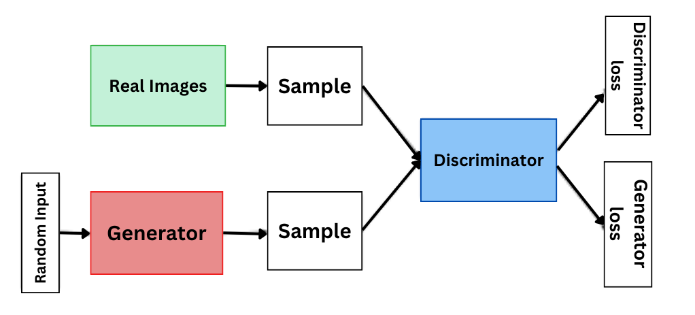

# Modelos de Difusión
## Diplomado Universidad de Tarapacá

Eugenio Herrera-Berg
Centro Nacional de Inteligencia Artificial

---

# ¿Qué es un modelo generativo?

Es un modelo que busca aprender a representar una distribución.

---

# ¿Qué es un modelo generativo?

Es un modelo que busca aprender a representar una distribución.

Es decir, dado:

- Dataset $X = \{x_{1}, x_{2}, ..., x_{n}\}$, cuya distribución instrínseca desconocida es $p\_data(x)$
- Una distribución paramétrica $p\_{\theta}(x)$

Buscamos encontrar los parámetros $\theta^{*}$ tales que:

$\theta^{*} = min \ D(p\_data \ || \  p\_{\theta})$

Donde $D$ representa alguna métrica de distancia o divergencia entre distribuciones.

---

# ¿Qué es un modelo generativo?

---

# Ejemplos de modelos generativos

- GPTs
- **Generative Adversarial Networks**
- Variational Autoencoders

---

# Generative Adversarial Networks

---

# Fortalezas GANs

- Generación de datos sintéticos de alta calidad.
- Rápida generación de imágenes.

---

# Debilidades GANs

Dificultad en aprender grandes distribuciones.

---
# ¿Por qué no basta con sólo GANs?

---
# ¿Por qué no basta con sólo GANs?

---

# Overview

1. Introduction to Diffusion Models
2. Mathematical Foundation
3. Implementation Details
4. Results and Applications

---

# ¿Qué son los Modelos de Difusión?

_"Crear ruido desde los datos es fácil;
crear datos desde ruido es modelamiento generativo."_

Song et.al. 2020

---

# ¿Qué son los Modelos de Difusión?

Denoising Diffusion Probabilistic Models [DDPM], 2020

---

# Denoising Diffusion Probabilistic Models (DDPMs)

DDPMs generan imágenes de forma progresiva a partir de ruido

Denoising Diffusion Probabilistic Models [DDPM], 2020

---

# Denoising Diffusion Probabilistic Models (DDPMs)

Para lograr que un modelo aprenda a generar imágenes a partir de ruido, necesitamos pares de entrenamiento en la forma de (ruido, imágenes).

Llamaremos al proceso que crea estos pares de entrenamiento **Forward Process**, encargado de convertir imágenes reales, en imágenes progresivamente más ruidosas.

---

# Denoising Diffusion Probabilistic Models (DDPMs)

Nuestro modelo generativo aprendererá a revertir este proceso (**Reverse Diffusion Process**). Es decir, progresivamente revertir el ruido de una imagen.

Una vez entrenado correctamente, el modelo contará con la capacidad recibir una imagen de ruido, y convertirla en una "real". En otras palabras, ¡generará imágenes desde puro ruido!

---

# Denoising Diffusion Probabilistic Models (DDPMs)

De manera más formal, los DDPMs iteran sobre $t$ pasos desde $0,1,...,T$

- $x_0$ es la imagen original
- $q(x_t|x_{t-1})$ es el forward process
- $p_{\theta}(x_{t-1}|x_t)$ es el reverse diffusion process (aprendido por nuestro modelo con parámetros $\theta$)

---

# Forward Process

El proceso de difusión puede ser descrito como:

$$q(x_t|x_{t-1}) = \mathcal{N}(x_t; \sqrt{1-\beta_t}x_{t-1}, \beta_t\mathbf{I})$$

donde:
- $x_t$ es la imagen con ruido en el paso $t$
- $\beta_t$ es el planificador de ruido (_noise scheduler_)
- $\mathcal{N}$ denota una distribución normal

---

# Forward Process

El proceso directo completo puede escribirse como:

$$q(x_{1:T}|x_0) = \prod_{t=1}^T q(x_t|x_{t-1})$$

y con el truco de reparametrización:

$$x_t = \sqrt{\alpha_t}x_0 + \sqrt{1-\alpha_t}\epsilon$$

donde

  - $\epsilon \sim \mathcal{N}(0, \mathbf{I})$
  - $\alpha_t = 1 - \beta_t$
  - $\bar{\alpha}_t = \prod_{i=1}^t \alpha_i$

---

# Truco de reparametrización

y con el truco de reparametrización:

$$x_t = \sqrt{\alpha_t}x_0 + \sqrt{1-\alpha_t}\epsilon$$

---

# Forward Process

<video controls width="90%">
  <source src="assets/videos/DiffusionProcess.mp4" type="video/mp4">
</video>

---

# Reverse process

El proceso inverso puede ser descrito como:
$$p_\theta(x_{t-1}|x_t) = \mathcal{N}(x_{t-1}; \mu_\theta(x_t,t), \Sigma_\theta(x_t,t))$$

donde:
- $x_t$ es la imagen con ruido en el paso $t$
- $\mu_\theta$ es la media de ruido predicha por la red neuronal 
- $\Sigma_\theta$ es la varianza de ruido predicha
- $\theta$ son los parámetros del modelo
---

# Training Process Visualization

<!-- Replace with your training visualization -->
<!-- <video controls width="80%">
  <source src="./assets/training.mp4" type="video/mp4">
</video> -->

---

# Results: Image Generation

Generated samples at different timesteps:
- Initial noise
- Intermediate steps
- Final output

<!-- Replace with your generation video -->
<video controls width="100%">
  <source src="assets/videos/DiffusionProcess.mp4" type="video/mp4">
</video>

---

# Comparison with Other Models

| Model | FID Score | Training Time | GPU Memory |
|-------|-----------|---------------|------------|
| DDPM | 3.21 | 24h | 16GB |
| DDIM | 4.16 | 12h | 12GB |
| Ours | 3.45 | 18h | 14GB |

---

<!-- _class: lead -->
# Gracias!

## Preguntas?

GitHub: ouhenio
Email: eugenio.herrera@cenia.cl

---

# Referencias
Esta presentación está **fuertemente** inspirada por:

- [El material de las clases de modelos de Difusión de IE University](https://github.com/julioasotodv/ie-c4-466671-diffusion-models)
- [Denoising Autoencoders | Deep Learning Animated](https://www.youtube.com/watch?v=0V96wE7lY4w)
- El siguiente video
