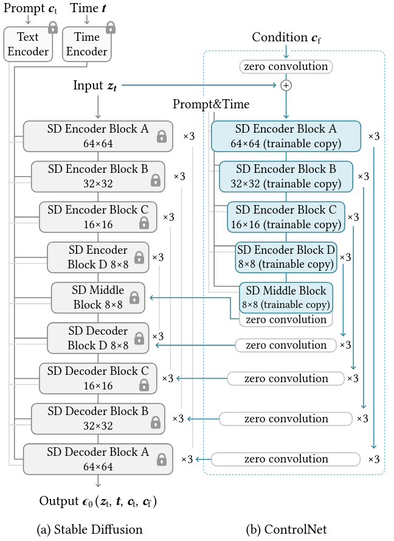

# Modelos de Difusión II
## Diplomado Universidad de Tarapacá

Eugenio Herrera-Berg
Centro Nacional de Inteligencia Artificial

---

# Overview

1. Comparación GANs vs VAEs vs Difusión
2. Generación Condicional
3. Precursores text-to-img
4. Large Difusion Models
5. Avances en Manipulación

---

# Comparando modelos generativos en CV

| Métrica | GANs | VAEs | Modelos de Difusión |
|---------|------|------|---------------------|
| **Calidad de Muestras** | Alta fidelidad | Borrosas, pérdida de detalles | Alta calidad |
| **Velocidad de Sampling** | Muy rápido (1 forward pass) | Muy rápido (1 forward pass) | Lento (50-1000 pasos) |
| **Cobertura de Modos** | Pobre (mode collapse) | Excelente (regularización KL) | Excelente |

---

# Generative learning trilemma

---

# Generación Condicional

Hasta el momento hemos visto modelos de difusión capaces de generar imágenes, pero sin un control asociado a esta generación.

Los modelos de difusión pueden ser condicionados para generar imágenes específicas basadas en:

- Texto
- Imágenes
- Señal cualquiera

Esto se logra a través de diferentes técnicas de **_guidance_**.

---

# Classifier Guidance

La guidance por clasificador utiliza un clasificador pre-entrenado para guiar el proceso de difusión:

$$p_\gamma(x|y) \propto p(x) \cdot p(y|x)^\gamma$$

donde:
- $p(y|x)$ es un clasificador entrenado con pares de imágenes ruidosas
- $y$ es la condición (clase)
- $\gamma$ determina la influencia del clasificador en la generación de la imagen

El gradiente del clasificador se usa para "empujar" la generación hacia la condición deseada.

---

# Classifier-free Guidance

Propuesta por Ho & Salimans (2021), elimina la necesidad de un clasificador separado:

El gradiente del score puede expresarse como una interpolación entre el score no condicionado y el condicionado:

$$\nabla_x \log p_\gamma(x|y) = (1-\gamma)\nabla_x \log p(x) + \gamma\nabla_x \log p(x|y)$$

donde:
- $\gamma$ es el peso de guidance
- $p(x)$ es la distribución no condicionada
- $p(x|y)$ es la distribución condicionada

<!-- Este enfoque:
- Es más eficiente computacionalmente
- No requiere entrenar un clasificador adicional
- Permite control más directo sobre la fuerza del conditioning -->

---

# Classifier-free Guidance

---

# DALL-E (2021)

---

# DALL-E (2021)

## Arquitectura Compuesta

**Stage 1: dVAE (discrete VAE)**
   - Comprime imágenes a tokens discretos
   - Reduce 256x256x3 a grid de 32x32 tokens (de 8192 valores posibles)
   - Permite representar imágenes como secuencias de tokens

**Stage 2: Transformer Autoregresivo**
   - 12B parámetros
   - Arquitectura GPT-3 modificada
   - Entrada: [tokens_texto, tokens_imagen]
   - Entrenado para predecir tokens de imagen dado el texto
   - Genera tokens de imagen uno a uno

---

# CLIP (2021)

CLIP (Contrastive Language-Image Pre-training) es un modelo que:

- Aprende representaciones conjuntas de texto e imagen
- Es entrenado con 400M de pares imagen-texto de internet

OpenAI liberó sus pesos al publicar el paper, demostrando sus fuertes capacidades de clasificación.

---

# CLIP (2021)

Contrastive Language-Image Pre-training [OpenAI], 2021

--- 

# [inserte modelo]+CLIP (2021-2022)

A los pocos días de ser liberado CLIP, ocurre un fenómeno particular en la (entonces pequeña) comunidad online de los aficionados por los modelos generativos en CV.

Un puñado de investigadores y desarolladores independientes comienzan a utilizar CLIP para guiar la generación de imágenes.

Todo esto ocurre en twitter y discord, donde comparten tips, y finalmente logran resultados equiparables con Dall-e.

---

# VQGAN+CLIP (2021-2022)

VQGAN+CLIP, Katherine Crowson (2021)

---

# Large Diffusion Models

- Stable Diffusion (Latent Diffusion)
- DALL-E 2
- Imagen
- Flux

---

# (Stable) Latent Diffusion (2021)

Durante esta fiebre de experimentación open source, un departamento de la Universidad de Heidelberg libera el paper Latent Diffusion, una arquitectura compuesta:

---

# (Stable) Latent Diffusion (2021)

En resumen:

1. Reduce dimensionalidad con encoder
2. Aplica difusión en espacio latente comprimido
3. Decoder recupera imagen final

Ventajas:
- Menor consumo de memoria
- Generación más rápida
- Mantiene calidad visual

---

# DALL-E 2 (2022)

Hierarchical Text-Conditional Image Generation [OpenAI], 2022

---

# Imagen (2022)

  

  Imagen de Google introduce:

  - Arquitectura U-Net en cascada
  - Múltiples niveles de resolución
  - Transformer para conditioning
  - T5 para embeddings de texto

  

Photorealistic Text-to-Image Diffusion Models [Google], 2022

---

# Flux (2024)

Flux.1 [Black Forest Labs], 2022

---

# Flux (2024)

  

  Modelo abierto* de los creadores de latent diffusion:

  - Reemplazan U-Net por Diffusion Transformer
  - Usan Rectified-Flow para entrenar el modelo
  - Estado del arte en generación de imágenes

  

---

# Avances en Manipulación

Técnicas recientes permiten:

- Personalización de modelos
- Control fino de la generación
- Edición de imágenes existentes
- Preservación de identidad

---

# Textual Inversion (2022)

An Image is Worth One Word: Personalizing Text-to-Image Generation using Textual Inversion [Tel-Aviv University], 2022

---

# Textual Inversion (2022)

Permite "enseñar" nuevos conceptos al modelo:

1. Se optimiza un embedding de texto específico
2. Se mantienen los pesos del modelo base
3. Se aprende a representar un concepto nuevo

$$L = \mathbb{E}_{x,t,\epsilon}[\|\epsilon - \epsilon_\theta(x_t,t,S^*)\|^2]$$

donde $S^*$ es el nuevo token aprendido

---

# Null-text Inversion (2022)

Null-text Inversion for Editing Real Images using Guided Diffusion Models [Google], 2022

---

# Null-text Inversion (2022)

Permite edición de imágenes a partir de texto:

1. Encuentra el prompt nulo óptimo para reconstruir una imagen
2. Usa este prompt como base para ediciones
3. Preserva mejor las características originales

$$L_{null} = \|\epsilon - \epsilon_\theta(x_t,t,\emptyset)\|^2 + \lambda\|x_0 - \hat{x}_0\|^2$$

---

# DreamBooth

DreamBooth: Fine Tuning Text-to-Image Diffusion Models [Google], 2022

---

# DreamBooth

Permite personalización con pocas imágenes:

- Fine-tuning específico por sujeto (del modelo completo)
- Usa token único identificador (flexible)
- Preserva capacidades generales
- Requiere 3-5 imágenes de referencia

---

# ControlNet (2023)

Adding Conditional Control to Text-to-Image Diffusion Models [Stanford], 2023

---

# ControlNet (2023)

Permite control preciso de la generación:

- Agrega redes de control a U-Net
- Mantiene pesos originales
- Soporta múltiples condiciones:
  - Poses
  - Profundidad
  - Segmentación
  - Canny edges

---

# IP-Adapter (2023)

IP-Adapter: Text Compatible Image Prompt Adapter for
Text-to-Image Diffusion Models [Tencent], 2023

---

# IP-Adapter (2023)

Permite control preciso de la generación:

- Agrega adaptadores livianos y paralelos al de texto cross-attention
- No requiere fine-tuning del modelo base
- Soporta múltiples condiciones basadas en imágenes

---

# Gracias!

## ¿Preguntas?

GitHub: ouhenio
Email: eugenio.herrera@cenia.cl

---

# Referencias

- DALL-E 2: Ramesh et al. (2022)
- Stable Diffusion: Rombach et al. (2022)
- Imagen: Saharia et al. (2022)
- DreamBooth: Ruiz et al. (2022)
- ControlNet: Zhang et al. (2023)

